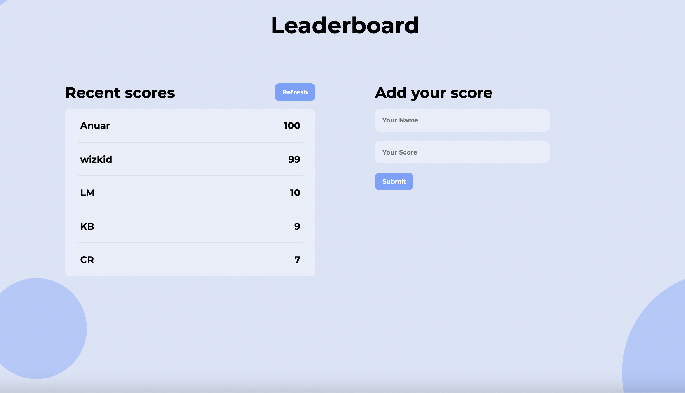

# Leaderboard

> The leaderboard website displays scores submitted by different players. It also allows you to submit your score. All data is preserved thanks to the external Leaderboard API service.

## Built With

- JavaScript
- HTML
- SCSS
- Webpack
- npm

## Live Demo

[Live Demo Link](https://anuarshaidenov.github.io/leaderboard/dist/)

## Installation

Go to your terminal, navigate to your working directory and run

`git clone https://github.com/anuarshaidenov/leaderboard.git`

After that navigate to the newly created folder

`cd leaderboard`

You now have access to the files.
To install necessary dependencies run

`npm install`

Start a local server running the command

`npm start`

You should now have the project running locally on a dev server.

## Author

👤 **Anuar Shaidenov**

- GitHub: [@anuarshaidenov](https://github.com/anuarshaidenov)
- Twitter: [@anuarnyi](https://twitter.com/anuarnyi)
- LinkedIn: [LinkedIn](https://www.linkedin.com/in/anuar-shaidenov-365a951b8/)

## 🤝 Contributing

Contributions, issues, and feature requests are welcome!

Feel free to check the [issues page](../../issues/).

## Show your support

Give a ⭐️ if you like this project!

## 📝 License

This project is [MIT](./MIT.md) licensed.
